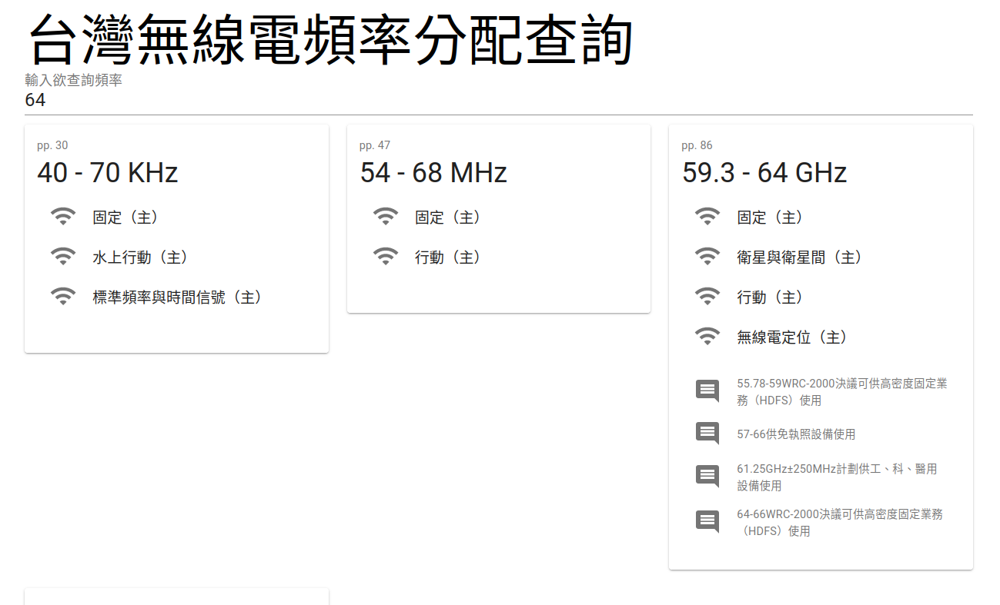

台灣無線電頻率分配表 (Table of Radio Frequency Allocations of Taiwan)
=====================================================================

Web Search: [Taiwan Radio Frequency Allocations Spectrum Search](https://blog.louie.lu/2021/03/14/taiwan-radio-frequency-allocations-spectrum-search/)

Run Parser
----------

```
$ poetry install
$ poetry run python spectrum_parser.py
$ cat spectrum.json
{
    "license": "Copyright (C) 2021 Louie Lu / This program is free software: you can redistribute it and/or modify it under the terms of the GNU General Public License as published by the Free Software Foundation, either version 3 of the License, or (at your option) any later version. / This program is distributed in the hope that it will be useful, but WITHOUT ANY WARRANTY; without even the implied warranty of MERCHANTABILITY or FITNESS FOR A PARTICULAR PURPOSE. See the GNU General Public License for more details. / You should have received a copy of the GNU General Public License along with this program. If not, see <http://www.gnu.org/licenses/>.",
    "spectrum": [
        {
            "range": [
                0.0,
                8.3
            ],
            "normalized_range": [
                0.0,
                83000.0
            ],
            "unit": "KHz",
            "unit_factor": 10000.0,
            "usage": [
                "未分配"
            ],
            "note": [],
            "page_number": 30
        },
		...
    ]
}
```

Data Structure
--------------

JSON
```
{
    'license': '...',
	'spectrum': [
		{Allocation},
		{Allocation},
		{Allocation},
		...
	]
}
```

Allocation
```
range -> List[float, float]: frequency range (w/o normalized)
normalized_range -> List[float, float]: normalized frequency range
unit -> str: frequency unit for this allocation
unit_factor -> float: frequency unit factor (range * unit_factor = normalized_range)
usage -> List[str, ...]: Usage of this allocation
note -> List[str, ...]: Detail of this allocation
page_number -> int: PDF page of this allocation
```

Web Frontend
------------



```
$ cd taiwan-spectrum-search
$ yarn start
```

TODO
----

- [] Radio Frequency Allocations Chart @ web frontend
- [-] Better search @ web front end
  - [-] Search by usage
  - [-] Search by note

Reference
---------

* [NCC 頻譜資料庫查詢系統](https://freqdbo.ncc.gov.tw/portal/index.aspx)
* [中華民國無線電頻率分配表 (2020/09 核定本)](http://odmdoc.motc.gov.tw/IFDEWebBBS_MOTC/ExternalBBS.aspx?ThirdDocId=109RD05188)
* [中華民國無線電頻率分配表 (2020/02 草案)](http://odmdoc.motc.gov.tw/IFDEWebBBS_MOTC/ExternalBBS.aspx?ThirdDocId=109RD05188)
* [United States Frequency Allocation Chart](https://www.ntia.doc.gov/page/2011/united-states-frequency-allocation-chart)
* [台灣頻譜分配圖 (2016/02)](https://freqdbo.ncc.gov.tw/upload/FILESAVE/080724081215.pdf)
